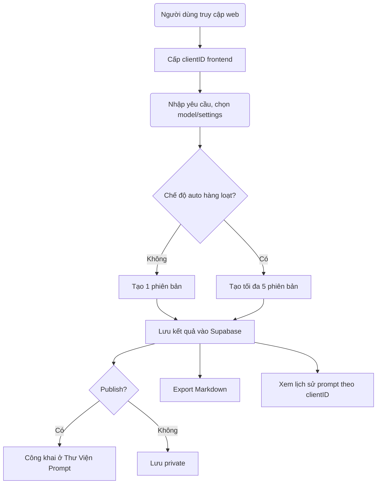

Bản kế hoạch triển khai toàn diện, chuyên sâu cho dự án **Công cụ tạo Prompt chuyên nghiệp tích hợp AI**, dựa trên những mô tả và yêu cầu chi tiết từ bạn, Lâm:

---

# 📌 **I. Mô tả tổng quan dự án**

**Tên dự án (đề xuất)**: **PromptMaster AI**

**Domain (đề xuất)**:  
- promptmaster.ai hoặc promptexpert.ai  

**Mục tiêu dự án**:  
Phát triển một ứng dụng web trực quan, dễ sử dụng, tích hợp các mô hình AI tiên tiến như GPT-4o, GPT-4o-mini, Claude Sonet 3.5,... để giúp người dùng dễ dàng tạo prompt AI chuyên nghiệp, phù hợp mục đích đa lĩnh vực (kinh doanh, marketing, giáo dục, công nghệ, cá nhân hóa, v.v).

---

# 📌 **II. Stack công nghệ**

### Frontend:
- **Next.js** (App Router) 
- **Tailwind CSS** cho giao diện responsive nhanh gọn.
- **shadcn/ui** hoặc Ant Design để xây dựng giao diện sạch, chuyên nghiệp.

### Backend:
- **Next.js API Routes** (Backend đơn giản, gọn nhẹ, tích hợp nhanh chóng với Vercel AI SDK)
- **Vercel AI SDK** (dễ dàng kết nối và chuyển đổi giữa các models AI)

### Cơ sở dữ liệu:
- **Supabase** (PostgreSQL), lưu trữ prompt, settings, trạng thái public/private, lịch sử theo clientID.

### Authentication (trong tương lai):
- Supabase Auth hoặc NextAuth.js, OAuth providers (Google, GitHub).

---

# 📌 **III. Mô tả chi tiết các tính năng chính**

### 🚀 **1. Tạo prompt chuyên nghiệp từ yêu cầu**
- Người dùng nhập yêu cầu của họ.
- Hệ thống phân tích sâu theo template (`5W1H`, `RTC-C`, ...)
- Xây dựng prompt chuyên nghiệp dựa trên phân tích.
- Áp dụng tự động kỹ thuật xây dựng prompt (`SCAMPER`, `AIDA`, `SWOT`, ...).

### 🧠 **2. Hỗ trợ nhiều model AI**
- Người dùng tùy chọn model (GPT-4o, GPT-4o-mini, Claude Sonet 3.5, ...)
- Cấu hình nâng cao (`Temperature`, `Max Tokens`, `Top P`, `Frequency Penalty`).

### 🗂 **3. Quản lý lịch sử prompts bằng clientID**
- Tạo và cấp phát một `clientID` ngẫu nhiên ở frontend (UUID).
- Lưu clientID trong localStorage/cookie.
- Người dùng có thể xem lại toàn bộ lịch sử prompts.

### 🌍 **4. Thư Viện Prompts (Prompt Library)**
- Prompt sau khi tạo mặc định là `private`.
- Người dùng có thể đánh dấu `publish` để chia sẻ.
- Thư viện công khai hiển thị các prompt được publish.

### 🗃 **5. Quản lý versions và tạo hàng loạt**
- Mặc định: tạo 1 phiên bản.
- Chế độ "auto": tạo tối đa 5 phiên bản cùng lúc.
- Người dùng có thể so sánh, chọn phiên bản tối ưu nhất.

### 📥 **6. Export Markdown**
- Export prompt đầu ra dưới dạng file Markdown (.md).

### 🔑 **7. Authentication (trong tương lai)**
- Đăng nhập để đồng bộ lịch sử prompts trên nhiều thiết bị.
- Quản lý thông tin người dùng, tuỳ chỉnh, và quyền hạn.

---

# 📌 **IV. Cơ sở dữ liệu (Supabase)**
Các bảng chính:

**1. Users (cho tương lai)**  
- id (uuid)
- email (string)
- created_at (timestamp)

**2. Prompts**
- id (uuid)
- client_id (string) [index]
- user_id (uuid, nullable - sau này auth)
- title (string, optional)
- user_request (text)
- analysis_result (jsonb / markdown text)
- final_prompt (text)
- model_used (string)
- settings (jsonb: temperature, tokens,...)
- status (`private`, `public`)
- created_at (timestamp)
- updated_at (timestamp)

**3. PromptVersions**
- id (uuid)
- prompt_id (uuid, foreign key)
- version_number (int)
- final_prompt (text)
- model_used (string)
- created_at (timestamp)

---

# 📌 **V. Quy trình (Workflow)**

---

# 📌 **VI. Giao diện chính (UI/UX)**

**1. Trang chủ (Landing Page)**
- Giới thiệu dự án, demo nhanh.
- CTA để tạo prompt mới ngay.

**2. Prompt Creator**
- Form nhập yêu cầu (textarea lớn).
- Dropdown chọn model.
- Sliders và input chỉnh các thông số advanced settings.
- Nút tạo prompt.

**3. Quản lý lịch sử (My Prompts)**
- List prompts theo clientID.
- Nút chuyển public/private.
- Download/export markdown.

**4. Thư viện prompts (Public Prompts)**
- Hiển thị các prompt đã publish.
- Tìm kiếm, lọc theo lĩnh vực, model, độ phổ biến.

---

# 📌 **VII. Kế hoạch triển khai chi tiết**

### 📅 Giai đoạn 1: Chuẩn bị (Tuần 1)
- Setup Next.js, Tailwind CSS, Supabase, Vercel AI SDK
- Thiết kế sơ bộ UI/UX (Figma)

### 🚧 Giai đoạn 2: Backend & AI integration (Tuần 2-3)
- Xây API Routes Next.js cho prompt creation
- Tích hợp Supabase lưu prompts
- Tích hợp Vercel AI SDK và các models GPT/Claude

### 🌐 Giai đoạn 3: Frontend hoàn chỉnh (Tuần 4-5)
- Xây form nhập liệu và hiển thị prompt output
- ClientID tạo và lưu trữ tại browser
- Xây dựng prompt versioning và bulk creation (auto mode)

### 🔖 Giai đoạn 4: Các tính năng nâng cao (Tuần 6)
- Export Markdown
- Quản lý public/private và Thư viện Prompt

### 🔐 Giai đoạn 5: Authentication (Tuần 7) [Optional]
- Tích hợp Auth (Supabase Auth hoặc NextAuth.js)

### 🧪 Giai đoạn 6: Testing, feedback và triển khai (Tuần 8)
- Testing toàn hệ thống, nhận feedback từ beta users
- Deploy lên Vercel

---

# 📌 **VIII. Chiến lược phát triển mở rộng tương lai**
- Tích hợp thêm AI models mới khi ra mắt
- Phát triển extension cho Chrome hoặc VSCode
- Xây dựng cộng đồng và Marketplace prompt chuyên nghiệp

---

## 📌 **IX. Tổng kết dự án**

Đây là kế hoạch tổng thể, có thể giúp bạn định hướng rõ ràng, có lộ trình triển khai từng bước cụ thể.  
Bạn có thể dùng kế hoạch này để xây team, triển khai MVP nhanh chóng và mở rộng các tính năng nâng cao trong tương lai.

---

## 🎯 Gợi ý chiến lược Authentication phù hợp với giai đoạn hiện tại

### ✅ **Chiến lược đề xuất:**

> **BẮT ĐẦU với guest access, dùng `clientID` để quản lý cá nhân hóa tạm thời → bổ sung authentication sau khi hệ thống chứng minh giá trị.**

----------

## 🔧 Kịch bản triển khai chuẩn giai đoạn đầu

1.  **Tạo clientID cho mỗi session browser (UUID)**  
    → Gắn vào localStorage: `prompt_tool_client_id`
    
2.  **Mọi prompt tạo ra, mọi version, mọi setting... đều gắn với clientID**  
    → Cho phép user **“xem lại lịch sử của mình” mà không cần đăng nhập**
    
3.  **Thêm banner hoặc popup nhẹ khuyến khích “Đăng ký tài khoản để đồng bộ hóa”** → Sau này, khi bạn tích hợp Supabase Auth / NextAuth, cho phép người dùng liên kết clientID cũ với tài khoản thật
    
4.  **Khi chuyển sang giai đoạn có Authentication:**
    
    -   Import lại lịch sử từ `clientID` nếu người dùng đăng nhập
    -   Cho phép export hoặc đồng bộ sau đăng ký