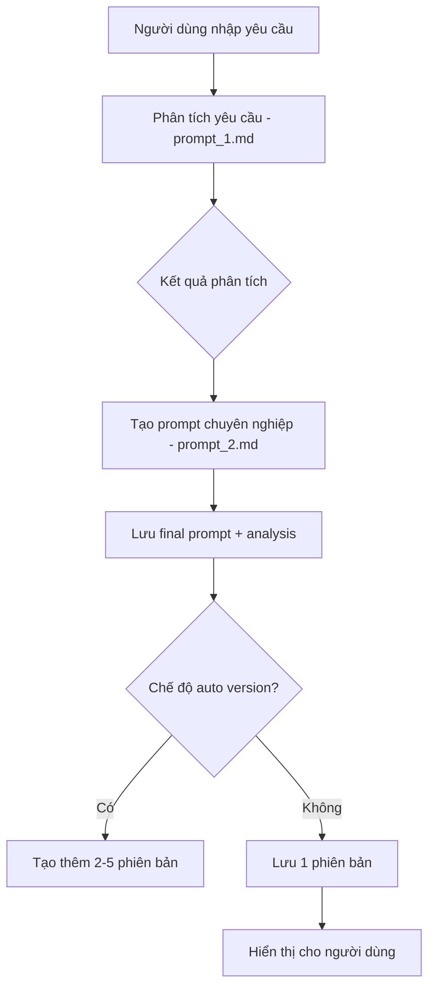

# 🚀 Tạo Prompt AI

Công cụ tạo Prompt chuyên nghiệp, giúp người dùng dễ dàng tạo prompt AI chuyên nghiệp, phù hợp mục đích đa lĩnh vực.

## 📌 Tính năng chính

### 🎯 1. Tạo prompt chuyên nghiệp từ yêu cầu
- Phân tích sâu theo template (5W1H, RTC-C, ...)
- Xây dựng prompt dựa trên phân tích
- Áp dụng tự động kỹ thuật xây dựng prompt (SCAMPER, AIDA, SWOT, ...)

### 🧠 2. Hỗ trợ nhiều model AI
- GPT-4o, GPT-4o-mini, Claude Sonet 3.5, ...
- Cấu hình nâng cao (Temperature, Max Tokens, Top P, Frequency Penalty)

### 🗂 3. Quản lý lịch sử prompts
- Lưu trữ theo clientID
- Xem lại toàn bộ lịch sử prompts

### 🌍 4. Thư viện Prompts
- Quản lý prompt private/public
- Chia sẻ prompt với cộng đồng

### 🗃 5. Quản lý versions và tạo hàng loạt
- Tạo nhiều phiên bản cùng lúc (tối đa 5)
- So sánh và chọn phiên bản tối ưu

### 📥 6. Export Markdown
- Xuất prompt dưới dạng file Markdown (.md)

## 🛠 Công nghệ sử dụng

### Frontend
- Next.js (App Router)
- Tailwind CSS
- shadcn/ui

### Backend
- Next.js API Routes
- Vercel AI SDK

### Cơ sở dữ liệu
- Supabase (PostgreSQL)

### Authentication (trong tương lai)
- Supabase Auth / NextAuth.js
- OAuth providers (Google, GitHub)

## 🚀 Bắt đầu

1. Clone repository:
\`\`\`bash
git clone https://github.com/bombap/taoprompt.com.git
cd promptmaster
\`\`\`

2. Cài đặt dependencies:
\`\`\`bash
npm install
\`\`\`

3. Cấu hình môi trường:
Tạo file \`.env.local\` và thêm các biến môi trường cần thiết:
\`\`\`
NEXT_PUBLIC_SUPABASE_URL=your_supabase_url
NEXT_PUBLIC_SUPABASE_ANON_KEY=your_supabase_key
OPENAI_API_KEY=your_openai_key
ANTHROPIC_API_KEY=your_anthropic_key
\`\`\`

4. Chạy development server:
\`\`\`bash
npm run dev
\`\`\`

5. Mở [http://localhost:3000](http://localhost:3000) trên trình duyệt.

## 📦 Cấu trúc và Luồng xử lý

### 🔄 Luồng tạo Prompt



### 📂 Cấu trúc thư mục

```
promptmaster/
├── app/                    # Next.js app router
│   ├── page.tsx           # Trang chủ
│   ├── create/            # Trang tạo prompt
│   ├── history/          # Trang lịch sử
│   └── library/          # Thư viện prompt
├── components/            # React components
│   ├── prompt-form/      # Form nhập yêu cầu
│   ├── analysis/         # Hiển thị phân tích
│   └── prompt-display/   # Hiển thị kết quả
├── lib/                  # Utilities và helpers
│   ├── prompts/         # Prompt templates
│   │   ├── prompt_1.md  # Template phân tích
│   │   └── prompt_2.md  # Template tạo prompt
│   └── db/              # Database utilities
└── types/               # TypeScript types
    └── models.ts       # Model definitions
```

### 🗃 Cấu trúc Database

#### Bảng `Prompts`
| Field | Loại | Mô tả |
|-------|------|-------|
| id | UUID | Primary key |
| client_id | string | ID browser |
| user_request | text | Yêu cầu gốc |
| analysis_result | text/jsonb | Kết quả phân tích |
| final_prompt | text | Prompt chính |
| model_used | string | Model AI sử dụng |
| auto_version | boolean | Chế độ tạo hàng loạt |
| status | enum | private/public |
| created_at | timestamp | Thời gian tạo |

#### Bảng `PromptVersions`
| Field | Loại | Mô tả |
|-------|------|-------|
| id | UUID | Primary key |
| prompt_id | UUID | FK to Prompts |
| version_number | int | Số phiên bản |
| final_prompt | text | Nội dung prompt |
| notes | text | Ghi chú |
| model_used | string | Model AI sử dụng |

### 🔌 API Endpoints

| Route | Method | Mô tả |
|-------|--------|-------|
| `/api/analyze` | POST | Phân tích yêu cầu |
| `/api/generate` | POST | Tạo prompt |
| `/api/version` | POST | Tạo phiên bản mới |
| `/api/prompts` | GET | Lấy lịch sử prompt |
| `/api/publish` | POST | Công khai prompt |
| `/api/public-prompts` | GET | Lấy thư viện prompt |

## 🤝 Đóng góp

Chúng tôi rất hoan nghênh mọi đóng góp! Hãy:

1. Fork dự án
2. Tạo branch mới (\`git checkout -b feature/AmazingFeature\`)
3. Commit thay đổi (\`git commit -m 'Add some AmazingFeature'\`)
4. Push lên branch (\`git push origin feature/AmazingFeature\`)
5. Tạo Pull Request

## 📄 Giấy phép

Dự án này được cấp phép theo giấy phép MIT - xem file [LICENSE](LICENSE) để biết thêm chi tiết.

## 📧 Liên hệ

- Website: [taoprompt.com](https://taoprompt.com)
- Email: contact@taoprompt.com
- GitHub: [github.com/bombap/taoprompt.com](https://github.com/bombap/taoprompt.com)

## 🙏 Cảm ơn

Cảm ơn bạn đã quan tâm đến Tạo Prompt AI! Chúng tôi hy vọng công cụ này sẽ giúp bạn tạo ra những prompt AI chuyên nghiệp và hiệu quả. 